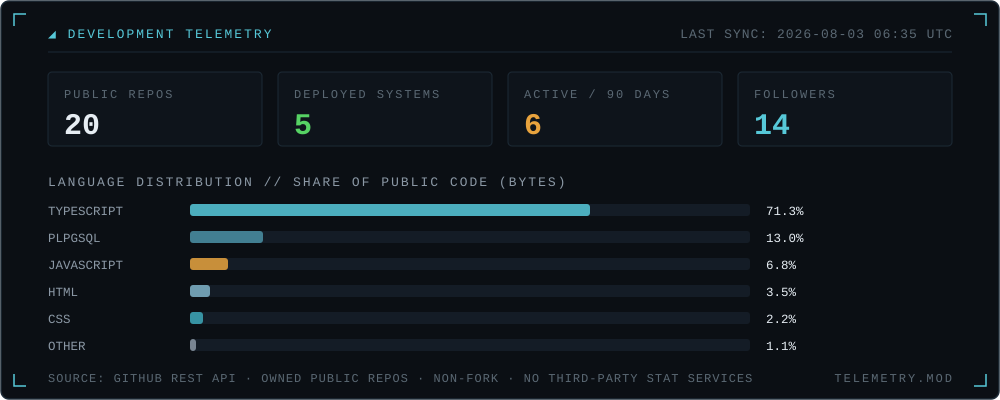

<!-- SENTINEL FORGE // SYSTEMS COMMAND DECK — profile of Jassim3nidad.
     Sections marked ACTIVITY / SYNC are regenerated weekly by
     .github/workflows/update-profile.yml — edit everything else freely. -->




## // ACTIVE OPERATION

| CHANNEL | SIGNAL |
|---|---|
| `BUILDING` | **[Venora](https://github.com/Jassim3nidad/venora)** — venue discovery & booking marketplace for the Philippine events market |
| `RESEARCHING` | LLM features that pay for themselves — per-feature model config, token/spend limits, and usage telemetry on Supabase Edge Functions |
| `LEARNING` | Payment integrity: webhook signature verification, idempotent event processing, commission snapshots |
| `FOCUS` | Production discipline — row-level security everywhere, per-role E2E coverage, additive-only migrations |
| `CHANNEL` | Internship-ready · 2026 — full-stack, AI, security → see [OPEN CHANNEL](#-open-channel) |

## // OPERATOR PROFILE

I'm Jassim Trinidad, a Computer Science student at Lyceum of the Philippines University – Cavite, building software that has to survive real users. My center of gravity is **Venora**, a venue-booking marketplace where I work on everything from Postgres row-level security and payment webhooks to AI-assisted search running on edge functions. Around it sit smaller systems: a realtime kanban platform, an automated booking engine, and anomaly-detection and NLP experiments from AI coursework. I care about the unglamorous parts — authorization boundaries, migrations, idempotent webhooks, and tests that prove one tenant can't read another's data. Current heading: deeper security engineering, and AI features that justify their cost.


## // FLAGSHIP SYSTEMS

### ⬢ SYS-01 · VENORA

`DEPLOYED SYSTEM` · `ACTIVE DEVELOPMENT`

> Booking an event venue in the Philippines is a fragmented mess of calls, spreadsheets, and unverified listings.

Venue discovery and booking marketplace: customers browse and book venues, owners and suppliers manage listings, and a tiered admin platform handles moderation, commissions, and reporting.

- **Stack:** Next.js 16 · React 19 · TypeScript · Supabase (Postgres + RLS) · Deno Edge Functions · OpenRouter · PayMongo · Tailwind v4 · Turborepo
- **Engineering record:** every table ships with row-level security, and admin power is split into fine-grained permissions backed by a `has_admin_permission()` SQL function — finance-only actions stay finance-only. 65 additive migrations, 7 edge functions (6 of them AI features), per-role Playwright E2E including cross-tenant isolation.
- **Links:** [repository](https://github.com/Jassim3nidad/venora) · [live system](https://venora-web.vercel.app)

### ⬢ SYS-02 · KANBAN

`DEPLOYED SYSTEM`

> Interns and management drift out of sync the moment work leaves the meeting room.

Realtime collaborative kanban: drag-and-drop boards with live sync, role-based access (member vs. admin oversight), and token-based guest links so outsiders can view or collaborate without an account.

- **Stack:** React 18 · Vite · Supabase (Postgres + Auth + Realtime) · RLS policies
- **Engineering record:** guest access is a scoped, shareable token — view-only or collaborator — enforced in the database schema, not just the UI.
- **Links:** [repository](https://github.com/Jassim3nidad/kanban) · [live system](https://kanban-three-black.vercel.app)

### ⬢ SYS-03 · NO-SHOW KILLER

`DEPLOYED SYSTEM`

> No-shows quietly drain barbershops and service businesses that book by DM and memory.

Automated appointment engine: two-step booking flow, live slot availability, admin dashboard, and a Zapier pipeline that fires calendar events, email, and SMS reminders on every confirmed booking.

- **Stack:** JavaScript · Express REST API · MongoDB Atlas · Zapier (Google Calendar, Gmail, Semaphore PH SMS) · Vercel + Render
- **Engineering record:** double-bookings are prevented at the database layer with a compound index on date + time — not by hoping the frontend checks first.
- **Links:** [repository](https://github.com/Jassim3nidad/noshowkiller) · [live system](https://noshowkiller.vercel.app)

### ⬢ SYS-04 · ANOMALY-LAB

`RESEARCH PROTOTYPE` · `AI COURSEWORK`

> Most anomaly detection demos are black boxes; this one shows its math.

Interactive outlier detector: upload a CSV or paste values, pick Z-score or IQR detection server-side, and explore flagged anomalies in a D3 visualization with a live threshold slider.

- **Stack:** PHP · D3.js · JavaScript
- **Engineering record:** statistics-first by design — interpretable z-thresholds and IQR fences instead of an opaque model, so every flagged point can be explained.
- **Links:** [repository](https://github.com/Jassim3nidad/anomaly-lab)

### ⬢ SYS-05 · SENTIMENT-ANALYSIS

`RESEARCH PROTOTYPE` · `AI COURSEWORK`

> Classifying real-world text as positive, neutral, or negative — and measuring how often you're right.

VADER-based sentiment analyzer shipped two ways: a command-line tool and a Streamlit web app with analysis history and full score breakdowns.

- **Stack:** Python · VADER (NLTK) · Streamlit
- **Engineering record:** evaluated against a 25-case labelled test set with measured accuracy, plus documented prompt-engineering comparisons — not just vibes.
- **Links:** [repository](https://github.com/Jassim3nidad/Sentiment-Analysis)

**ARCHIVED BUILDS //** [7th-south-street](https://github.com/Jassim3nidad/7th-south-street) (Next.js 14 + PHP 8.2 + MySQL e-commerce), [NLTKBot](https://github.com/Jassim3nidad/NLTKBot) (NLTK pattern-matching chatbot, group project), [portfolio](https://github.com/Jassim3nidad/portfolio) ([live](https://jassim3nidad.vercel.app)), and a shelf of 2024 Python fundamentals — kept public as the paper trail.


## // SYSTEMS CAPABILITY MATRIX

Classifications are honest: **PRIMARY** = used daily in shipped systems · **PROJECT EXPERIENCE** = shipped with it at least once · **WORKING KNOWLEDGE** = used, still consolidating · **EXPLORING** = actively studying.

| DOMAIN | SYSTEMS | CLASS |
|---|---|---|
| **Languages** | TypeScript, JavaScript | `PRIMARY` |
| | Python, SQL (Postgres / PLpgSQL), PHP | `PROJECT EXPERIENCE` |
| **Frontend** | Next.js (App Router), React, Tailwind CSS | `PRIMARY` |
| | TanStack Query, React Hook Form + Zod, Vite, D3.js, Streamlit | `PROJECT EXPERIENCE` |
| **Backend** | Supabase (Auth · RLS · Realtime · Edge Functions) | `PRIMARY` |
| | Node.js / Express, Deno, Flask, PHP REST APIs | `PROJECT EXPERIENCE` |
| **Data & Storage** | PostgreSQL (RLS, triggers, migrations) | `PRIMARY` |
| | MongoDB Atlas, MySQL | `PROJECT EXPERIENCE` |
| **AI / ML** | LLM integration (OpenRouter: config, cost limits, moderation), NLP (NLTK, VADER), statistical anomaly detection | `PROJECT EXPERIENCE` |
| | Model training & evaluation beyond lexicon methods | `EXPLORING` |
| **Security** | Row-level security & tiered RBAC, webhook signature verification, idempotent payment processing, cross-tenant isolation testing | `PROJECT EXPERIENCE` |
| | Offensive security & threat detection | `EXPLORING` |
| **Infrastructure** | Vercel | `PRIMARY` |
| | Render, Zapier automation, GitHub Actions, Docker | `WORKING KNOWLEDGE` |
| **Engineering Tools** | Turborepo + pnpm, Playwright, Vitest, Git | `PROJECT EXPERIENCE` |

## // ENGINEERING PROTOCOLS

1. **SECURE BY DEFAULT** — every Venora table has row-level security; privileged SQL functions get explicit revokes, not implicit trust.
2. **VALIDATE AT EVERY BOUNDARY** — Zod schemas on input, signature checks on webhooks, constraints in the database. The frontend is never the last line of defense.
3. **PROVE IT, DON'T ASSUME IT** — per-role E2E suites that try to read other tenants' data; a labelled test set before calling a classifier "done."
4. **SHIP TO REAL URLS** — systems go to production with real users, payments, and consequences; localhost is not a portfolio.
5. **CHANGE ADDITIVELY** — 65 ordered migrations and counting; applied history is never rewritten.


## // DEVELOPMENT TELEMETRY



Regenerated weekly by [`update-profile.yml`](.github/workflows/update-profile.yml) using the built-in `GITHUB_TOKEN` — no third-party stat services, no fabricated numbers. If the panel looks stale, the workflow simply hasn't run yet; the committed version is the last real reading.

## // ACTIVITY LOG

Latest meaningful transmissions across public systems — dependency-bot noise filtered out, refreshed on the same weekly cycle:

<!-- ACTIVITY:START -->
```text
2026-07-13  venora ················ docs(suppliers): plan dashboard completion
2026-06-25  kanban ················ Validate email existence before sending passw…
2026-06-19  portfolio ············· Fix mobile responsiveness: resolved menu back…
2026-06-17  7th-south-street ······ feat: integrate official brand logo and refin…
2026-05-24  noshowkiller ·········· Add comprehensive README with automation docs
```
<!-- ACTIVITY:END -->


## // OPEN CHANNEL

| FREQUENCY | COORDINATES |
|---|---|
| `GITHUB` | [github.com/Jassim3nidad](https://github.com/Jassim3nidad) |
| `PORTFOLIO` | [jassim3nidad.vercel.app](https://jassim3nidad.vercel.app) |
| `LINKEDIN` | [linkedin.com/in/jassim-trinidad](https://linkedin.com/in/jassim-trinidad) |
| `EMAIL` | [trinidad.softwareengr@gmail.com](mailto:trinidad.softwareengr@gmail.com) |

Available for thoughtful collaborations, internships, and systems worth building.

---

<div align="center">

`SENTINEL FORGE · PROFILE.V1` <!-- SYNC:START -->
`LAST TELEMETRY REFRESH: 2026-07-13 01:28 UTC`
<!-- SYNC:END -->

*Transmission complete. Somewhere in the queue, the next system is already compiling.*

</div>
